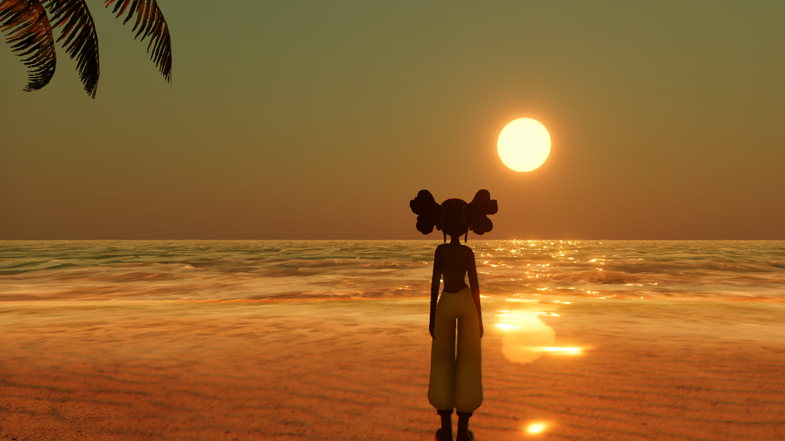

# Water System For URP.
Water system designed for mobile platforms, fully integrated into the Unity URP Pipeline, and packed with different features and tools.

## Features
[Development Log](https://jojo-lyu.notion.site/Dev-Log-Water-6566510c7cea429d83263e5184f46413?pvs=4)
- [x]  Reflection
- [x]  Refraction
- [x]  Color Adjust
- [x]  Flow Map
- [x]  Bump
- [x]  Gerstner Wave
- [x]  Foam
- [x]  Ripple
- [x]  Caustics
- [x]  Caustics Dispersion
- [ ]  Under Water
- [x]  SSS
- [ ]  Waterfall
- [ ]  FFT

# References
* [The technical art of sea of thieves](https://dl.acm.org/doi/10.1145/3214745.3214820#sec-ref)
* [Water Rendering in 'Far Cry 5'](https://www.gdcvault.com/play/1025555/Advanced-Graphics-Techniques-Tutorial-Water)
* [Flow Map](https://graphicsrunner.blogspot.com/2010/08/water-using-flow-maps.html)
