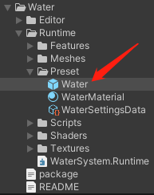
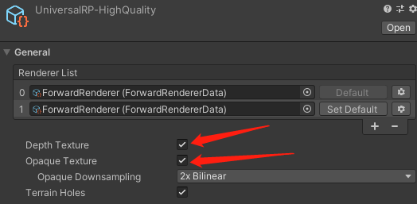
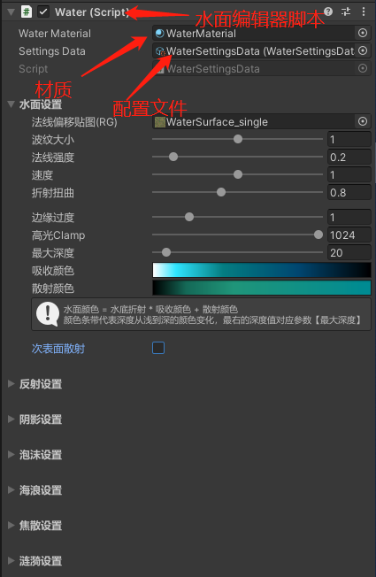

基于URP的水体效果，支持移动端。

## 特性
 * 根据深度的颜色变换
 * 次表面散射
 * 焦散
 * 折射
 * 反射（多种模式）
 * 阴影
 * 多光源
 * GI
 * Gerstner海浪
 * 物体随海浪浮动
 * 动态物体与水面交互

KMS：http://kms.sys.wanmei.net/pages/viewpage.action?pageId=48793169

## 如何使用

1. **把该仓库导入工程的Package中**

2. **把预制体SeaVisual直接拽到场景中**

   

3. **水体需要用到深度图和不透明物体颜色做折射，在Pipeline里勾上**

   
  
4. **参数面板**
    
    在Water脚本上进行编辑修改，若需要制作新的水面，需要复制新的配置文件和材质挂到Water脚本上。
    
   
   
5. **支持海面上的物体随着海浪浮动，给物体添加BuoyantObject组件，运行即可。**
